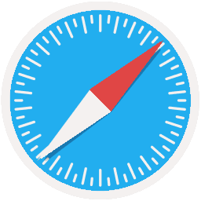
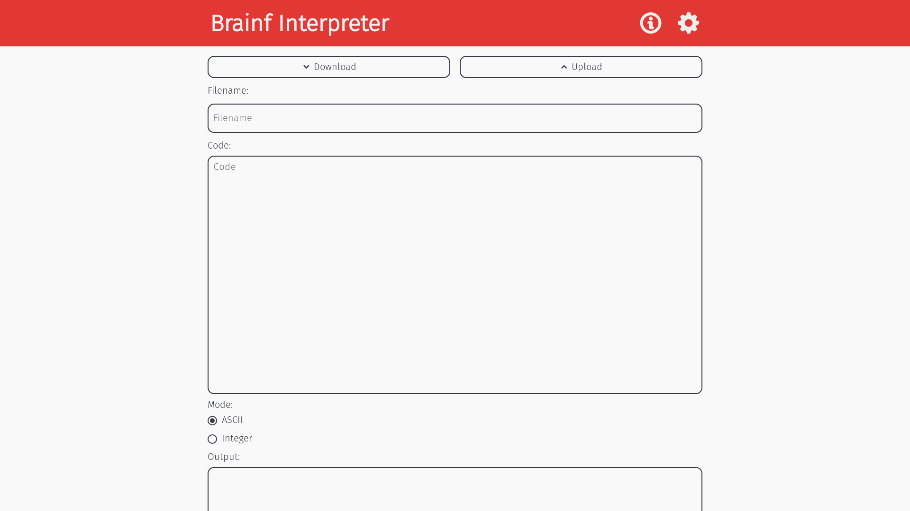
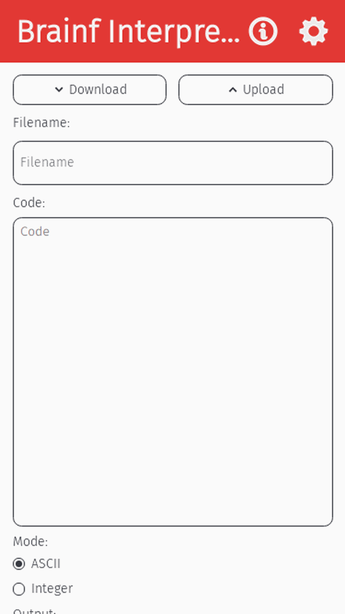
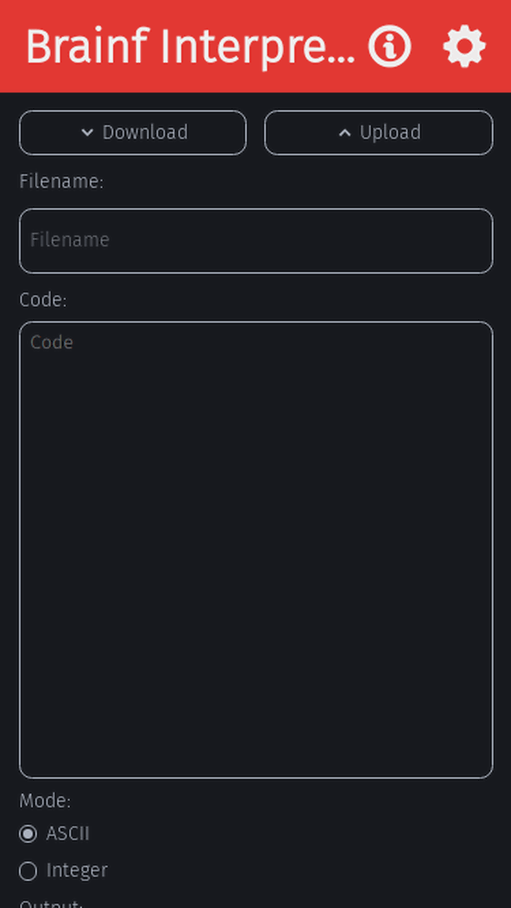
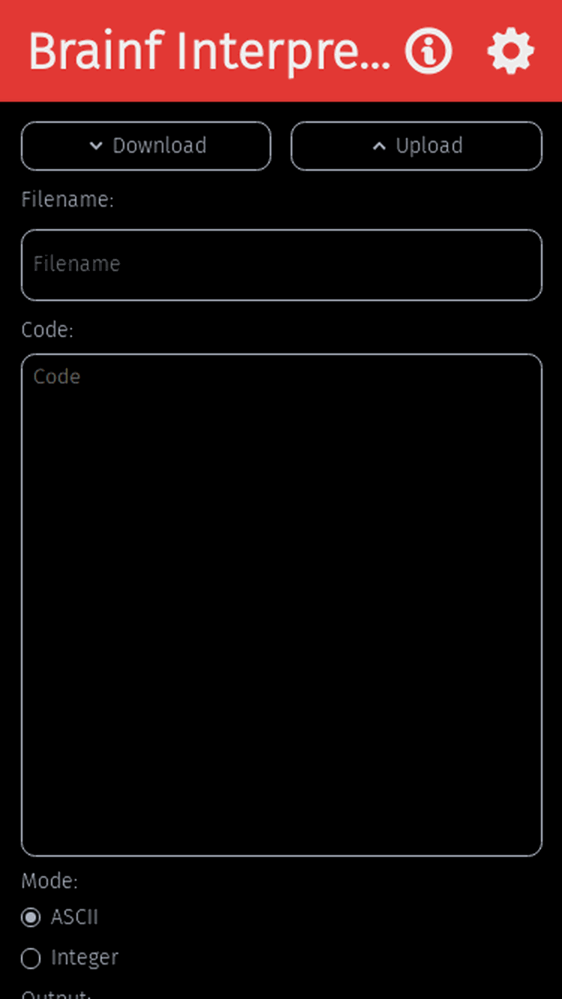

[](../../)
[](https://www.codacy.com/gh/FHPWA/Brainf)
[](../../)
[](../../issues)
[](/LICENSE.md)
[](../../commits/master)
[](../../commits/master)


An online version of an Android application that I released in
the hope that it will be more accessible. Run programs written
in the Brainf programming language.

Find the site on https://fhpwa.github.io/brainf/

## Language information
PWA.Brainf is built with HTML5, CSS3 and JavaScript

## Changelog
See the [CHANGELOG](/CHANGELOG.md) for more information.


## Download
### Clone
#### Using The Command Line
1. Press the Clone or download button in the top right
2. Copy the URL (link)
3. Open the command line and change directory to where you wish to clone to
4. Type 'git clone' followed by URL in step 2
```bash
$ git clone https://github.com/[user-name]/[repository]
```

More information can be found at https://help.github.com/en/articles/cloning-a-repository

#### Using GitHub Deskto
1. Press the Clone or download button in the top right
2. Click open in desktop
3. Choose the path for where you want and click Clone

More information can be found at https://help.github.com/en/desktop/contributing-to-projects/cloning-a-repository-from-github-to-github-desktop

### Download Zip File

1. Download this GitHub repository
2. Extract the zip archive
3. Copy/ move to the desired location


## Licence
MIT License
Copyright (c) Kieran W
(See the [LICENSE](/LICENSE.md) for more information.)

## Browser Support

### Supported
FredHappyface PWAs are built with the following browsers in mind:
Google Chrome


Chromium Based Browsers


Safari



Microsoft Edge (Chromium)


### Unsupported
FredHappyface PWAs are not designed for the following browsers
(though they may still run as expected in some cases, such as on
Firefox). Functionality and visuals may not work as expected:
Firefox


Microsoft Edge (EdgeHTML)


Internet Explorer


TOR Browser


Other Browsers


## Screenshots

### Desktop
|Screenshots|
|:-:|
|  |
|  |
|  |


### Mobile
|Screenshots| |
|:-:|:-:|
|  |  |
|  |  |


### Themes
|Light|Dark|Black|
|:-:|:-:|:-:|
|  |  |  |
